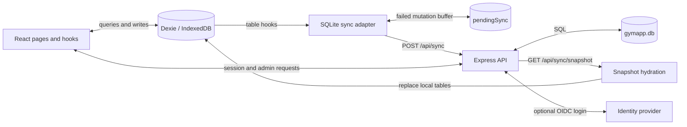

# Architecture

This document describes the current working tree, including uncommitted implementation changes, as inspected on 2026-09-08. It documents implemented behavior; limitations below are conclusions from source inspection, not a comprehensive security audit.

## System overview

Gymapp is a gym and workout tracker with a React browser application, a local IndexedDB database, and an Express API backed by SQLite. The UI reads and writes local data directly. A sync adapter forwards mutations to the server, and a snapshot endpoint restores an account's data on a fresh browser or account change.

The current application requires server authentication to enter its main routes. Although the README describes the server as optional, there is no standalone local authentication mode in the current route guards. Local persistence supports work during a connectivity interruption after entry; it does not guarantee an offline cold start.



Production serves the static frontend and API from the same Express process. Development runs Vite separately and proxies `/api` to Express.

## Code organization and boundaries

| Location | Responsibility |
| --- | --- |
| [src/main.tsx](src/main.tsx) | Installs Dexie sync hooks before rendering React with `StrictMode` and `BrowserRouter`. |
| [src/App.tsx](src/App.tsx) | Context providers and nested route guards/layouts. |
| `src/pages/` | Route-level screens, forms, and some direct database operations. |
| `src/components/` | Shared UI, route guards, workout controls, history, and charts; admin panels live in `admin/`. |
| `src/hooks/` | Workout lifecycle, active-workout lookup, and measurement reminders. |
| [src/db/db.ts](src/db/db.ts) | Domain interfaces, IndexedDB schema, singleton database, and default exercise seeding. |
| [src/db/sqliteSync.ts](src/db/sqliteSync.ts) | Mutation capture, HTTP delivery, and local retry outbox. |
| [src/db/hydrate.ts](src/db/hydrate.ts) | Full account snapshot replacement in a Dexie transaction. |
| `src/auth/` | Typed wrappers for session/setup/OIDC and administrator HTTP APIs. |
| `src/context/`, `src/i18n/` | Session identity, theme, language, and translation dictionaries. |
| [server/index.js](server/index.js) | SQLite initialization, auth, setup, administration, OIDC flow, sync, and static hosting. |
| `server/lib/` | Extracted password/cookie, column projection, and OIDC verification helpers. |
| [shared/syncSchema.js](shared/syncSchema.js) | Runtime sync table and column allowlists shared between client and server; accompanied by TypeScript declarations. |

The frontend uses React 19, React Router 7, TypeScript, Tailwind CSS 4, Lucide icons, and Recharts. Application state primarily lives in Dexie and is observed with `useLiveQuery`; React state holds transient form and interaction state. There is no general repository/service abstraction between UI code and Dexie.

The backend is plain Node ESM JavaScript using Express 5 and `sqlite3`. Most backend responsibilities remain in one module. Promise wrappers around `db.run`, `db.get`, and `db.all` provide database access without an ORM. Importing this module opens a SQLite database even in tests; test mode suppresses automatic initialization and listening.

## Entry, routing, and account lifecycle

Providers are nested as language → theme → session. Language and theme can render before authentication because they read the first cached profile and use in-memory defaults when none exists.

| Route | Screen / access |
| --- | --- |
| `/setup` | Initial administrator setup. |
| `/auth` | Username/password login, registration, and optional OIDC entry. |
| `/onboarding` | Local profile creation after authentication. |
| `/` | Training and gym selection. |
| `/workout/:gymId` | Start or resume a workout. |
| `/workout/:workoutId/edit` | Edit an existing workout. |
| `/workout/:workoutId/view` | Workout details. |
| `/analysis` | Workout history and exercise/body progress. |
| `/profile` | Profile editing. |
| `/settings` | Preferences, JSON export, local reset, and logout. |
| `/settings/gyms`, `/settings/exercises` | Gym and exercise management. |
| `/admin` | User and OIDC administration. |

All routes except `/setup` sit behind `RequireSetup`, which checks whether the server has any users. Protected routes then pass through `RequireAuth`; main screens also require a local profile through `RequireUser` and share `Layout`. `/admin` adds `RequireAdmin`. Browser guards control navigation; API handlers separately enforce authorization.

`SessionProvider` obtains the authenticated account from `/api/auth/me`. `RequireAuth` makes its own session request and compares that identity with the first local profile. If the cache is empty or belongs to another account, it deletes and reopens the local database, then hydrates a snapshot. A matching local profile skips hydration. This is a single-account browser cache, not a local multi-account database.

Logout invalidates the server session, deletes/reopens IndexedDB, refreshes session context, and navigates to authentication. The settings reset also deletes/reopens IndexedDB and reloads; it does not delete server data, which can be restored by hydration.

## Domain and persistence model

| Entity | Relationships and purpose |
| --- | --- |
| `User` | Local profile, body attributes, reminder frequency, language, theme, and accent color. The server row additionally stores account credentials, admin status, OIDC identity, and account timestamps. |
| `Gym` | User-owned training location with visit count and last-visited timestamp. |
| `Exercise` | User-owned exercise name and optional muscle group. |
| `GymEquipment` | Connects a gym and exercise with an equipment name and conversion factor. |
| `Workout` | Belongs to a user and gym; records start, optional end, and duration. |
| `WorkoutSet` | Belongs to a workout and exercise; optionally references equipment. Stores warmup/working type, sequence, weight, repetitions, optional RPE, and timestamp. |
| `UserMeasurement` | Timestamped user weight and body-fat history. |
| `PendingMutation` | Local-only payload and creation timestamp for retries. |

Timestamps are JavaScript epoch milliseconds; workout duration is seconds, weight is kilograms, and height is centimeters. An absent workout `endTime` marks an active workout.

IndexedDB is named `GymAppDB`. All eight stores are defined in a single Dexie `version(1)` with auto-increment numeric IDs and indexes for common lookups. The populate callback seeds exercises using translation keys for names and muscle groups; custom values are handled by display helpers in [src/lib/utils.ts](src/lib/utils.ts).

SQLite stores the seven synchronized domain tables plus `sessions`, `app_settings`, and `oidc_states`. The server attempts to enable WAL mode. Account IDs are server-generated; the six other domain tables use composite primary keys `(userId, id)`, allowing different users to reuse local numeric IDs. The local profile ID matches the authenticated server account.

Relationships are represented by ID columns, without SQL foreign-key declarations. Application code performs relationship checks and explicit cleanup. Schema changes must be coordinated across Dexie interfaces/stores, SQLite `CREATE TABLE` statements, the shared allowlists, and their declarations. Current repository guidance assumes no existing production database and directs changes into the initial schemas; there is no migration framework for upgrading an existing installation.

## Workout and analysis behavior

[useWorkoutSession](src/hooks/useWorkoutSession.ts) owns workout creation/resumption, selected exercise state, set insertion/removal, completion, and cancellation. It prefers an active workout at the requested gym and can fall back to the user's most recent active workout. Completion writes end time and elapsed duration. Cancellation deletes the workout and its sets in one local transaction and suppresses automatic recreation.

[useActiveWorkout](src/hooks/useActiveWorkout.ts) finds the current session user's most recent unfinished workout for navigation/resumption. Other screens often query entire local tables or the first user, relying on the single-account cache invariant.

Analysis runs in the browser. `ProgressChart` filters working sets for the selected exercise and time range, groups them by local calendar date, and calculates maximum weight and total volume. `BodyProgressChart` reads measurement history. Measurement reminders are derived from the cached user's preference and latest measurement; they are not a server scheduler.

## Sync protocol and consistency

1. UI code writes to Dexie; `useLiveQuery` updates local views.
2. Hooks on synchronized tables produce `upsert`, `update`, or `delete` payloads for `POST /api/sync`. Creation captures the generated ID in its success callback; update/delete hooks schedule delivery with microtasks.
3. Before sending a new mutation, the adapter attempts to flush queued failures. Network errors and server 5xx responses cause buffering in `pendingSync`.
4. The outbox retries on initialization, the browser `online` event, every 30 seconds, and before new mutations. A flush processes queued rows in creation-time order and stops at the first retryable failure.
5. The server projects allowed columns, derives ownership from the session, and applies SQL scoped to that account. It checks ownership of a referenced workout when inserting or reassigning a workout set.

The snapshot endpoint returns the profile separately from the six account-scoped tables and excludes authentication fields. Hydration clears/repopulates the seven domain stores in one Dexie transaction while suppressing outbound sync. The hydration helper itself does not clear `pendingSync`; the normal account reconciliation flow first deletes the entire local database.

There is no continuous pull, polling for remote changes, change cursor, record version, conflict resolver, or tombstone protocol. Same-account changes on another device are not automatically imported into an already populated cache. Server upserts overwrite supplied columns on a matching key.

## Authentication and administration

| API group | Responsibility |
| --- | --- |
| `GET /api/setup/status`, `POST /api/setup` | Detect empty installation and create its first administrator. |
| `POST /api/auth/register`, `/login`, `/logout`; `GET /api/auth/me` | Local account registration and cookie sessions. |
| `GET /api/auth/oidc/status`, `/login`, `/callback` | Optional external identity login. |
| `GET`, `PUT /api/admin/oidc` | Administrator configuration of issuer, client credentials, and scopes. |
| `GET`, `POST /api/admin/users` | List and create accounts. |
| `PATCH`, `DELETE /api/admin/users/:id` | Change administrator status and delete accounts. |
| `POST /api/admin/users/:id/password` | Reset a password and invalidate existing sessions. |
| `POST /api/sync`, `GET /api/sync/snapshot` | Account-scoped mutations and snapshots. |

Passwords use salted scrypt hashes and timing-safe comparison. Random session tokens are stored in SQLite and sent in the `gymapp_session` cookie with `HttpOnly`, `SameSite=Lax`, a 30-day lifetime, and optional `Secure`. Selected authentication endpoints use in-memory rate limits. Express trusts one proxy hop.

OIDC uses discovery, authorization code flow with PKCE S256, stored state and nonce, and a ten-minute state expiry. `jose` verifies ID-token signatures against provider JWKS and validates issuer/audience and token time claims; the callback separately checks nonce. Provider configuration, including the client secret, lives in SQLite `app_settings`. Discovery and JWKS resolvers are cached in process memory.

Setup creates an administrator. Startup bootstrap can promote `ADMIN_USERNAME`, or the first account if no administrator exists. Admin account routes include self-demotion/self-deletion and last-admin guards. The sync profile column allowlist excludes credentials and administrator status.

## Findings and architectural constraints

These are current implementation properties and follow-up areas, not changes made by this document.

- **Offline entry is incomplete.** `RequireAuth` needs a successful server session check; there is no service worker or explicit offline session fallback. README claims of a fully optional server are broader than implemented behavior. The `userId: 1` note in `AGENTS.md` and some model comments also lag the session-based implementation.
- **Sync delivery is best-effort.** Every 4xx response, including 401 and 429, is considered terminal and discarded without reconciliation. A locally successful edit can therefore remain absent from the server after session expiry or rejection.
- **The outbox is not a transactional write-ahead log.** Mutations are persisted there only after delivery fails. Update/delete hooks do not wait for transaction completion, and local transactions are not mirrored as server transactions. Browser closure or rollback can leave the databases inconsistent.
- **Mutation ordering is not globally serialized.** A concurrent caller can skip an already-running flush and send immediately; a new mutation is still sent after an earlier queued mutation fails. Dependent writes can arrive out of order, including a set before its workout.
- **IDs are unique per account, not per device.** Two devices for the same user can allocate the same auto-increment ID independently. The server's composite key prevents cross-user collisions but cannot distinguish these same-user records.
- **Account switching and unsent work need care.** Sync initializes before session/cache reconciliation, and queued entries carry no separate account identity. Requests use the current cookie and server-assigned owner. Database deletion on logout/account change also removes pending work. These paths have no explicit coordination with in-flight sync.
- **Referential integrity is partial.** SQL has no foreign-key constraints or general cascades, and sync validates only selected relationships. Local multi-table cleanup becomes separate HTTP operations. Snapshot reads span separate SQL queries without a snapshot transaction.
- **Administrator safeguards are endpoint-specific.** The ordinary sync API permits deletion of the authenticated `users` row and associated data, without the admin route's self-deletion/last-admin guards. Route-level safeguards therefore do not establish a system-wide invariant.
- **Exercise seeding and hydration differ.** Seeding occurs on database creation, but hydration then replaces the exercise table with the server snapshot, including an empty array. Seed delivery also uses the best-effort sync hooks; the initial catalog is not guaranteed by a server-side seed operation.
- **Maintenance boundaries are lightweight.** UI components directly access storage, the server centralizes many concerns, and shared allowlists do not provide full runtime field validation. Adding features requires coordinated changes and focused tests across those boundaries.

## Development, deployment, and verification

Use `npm install`, then run the API and Vite in separate terminals:

```sh
PORT=3000 DATA_DIR=./db node server/index.js
VITE_API_TARGET=http://localhost:3000 npm run dev
```

Vite defaults its API proxy to `http://localhost:80`. Aliases `@/*` and `@shared/*` resolve app and shared modules. Vite embeds the short Git commit for build identification. `npm run build` runs TypeScript project checking followed by Vite bundling; `npm run preview` only previews the frontend build. ESLint configuration targets TypeScript/TSX, so it does not provide equivalent configured coverage for the JavaScript server.

The two-stage [Dockerfile](Dockerfile) builds assets and installs production dependencies in a Node Alpine runtime. Express serves `dist/` and falls back to `index.html` for client routes. `PORT` defaults to `80`; `DATA_DIR` defaults to `/app/data`, containing `gymapp.db`. `COOKIE_SECURE`, `PUBLIC_URL`, and `ADMIN_USERNAME` configure cookie transport, OIDC callback origin, and administrator bootstrap.

[docker-compose.yml](docker-compose.yml) mounts `./db` for persistence and expects an external Traefik network. [.gitlab-ci.yml](.gitlab-ci.yml) builds and publishes amd64/arm64 container images on `latest` or `v*` tags; it has no dedicated lint/test stage. The Docker build runs the application build but not the test suite.

Vitest uses a Node environment with `NODE_ENV=test`:

- `server/lib/*.test.js`: password/cookie helpers, column projection, and OIDC token verification using an in-memory JWKS.
- `server/sync.test.js`: HTTP setup/authentication and sync ownership/scoping against temporary SQLite storage.
- `server/adminUsers.test.js`: HTTP account management, authorization, validation, and session invalidation.
- `test/hydrate.test.ts`: snapshot replacement and request-failure behavior using `fake-indexeddb`.

Run `npm test` for the suite. Integration tests bind ephemeral local ports. There are currently no browser end-to-end tests, workout lifecycle tests, or direct outbox retry/concurrency tests; passing the existing suite does not establish offline or multi-device consistency.
